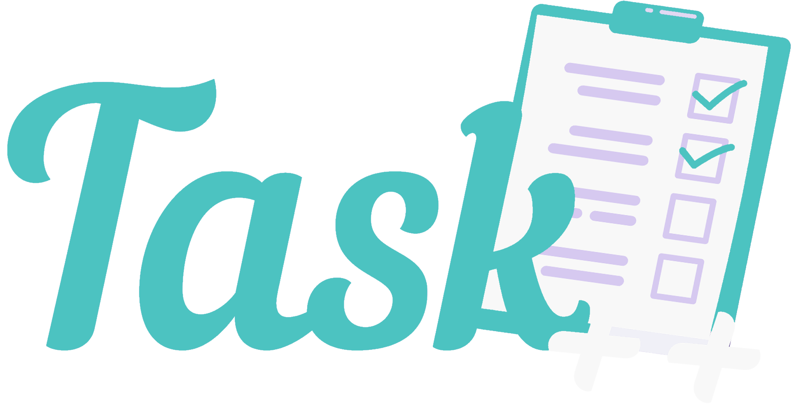
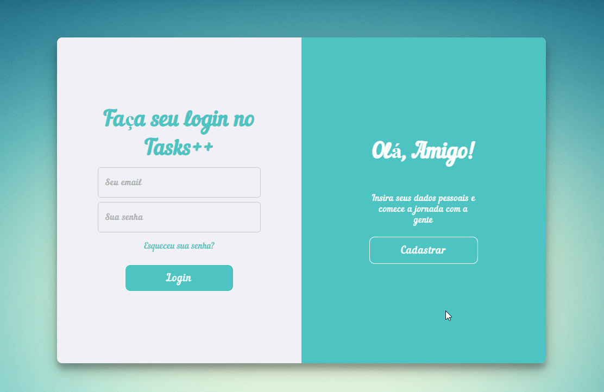

<h1 align="center">
  

<!--  -->

</h1>

 

## 📖 About the project

This project is being developed during the 2nd period of our college [Estácio de Sá University](https://www.estacio.br/) 🏫. 
in the discipline of Web Development with HTML, CSS, JavaScript, and PHP.

This application was developed to record and manage the time spent performing some activity or sub-activity, displaying reports and comparison charts.

## 🤖 Technologies

Technologies used to develop this application

- [HTML 5](https://www.w3schools.com/html/)
- [HTML 5 2](https://www.w3schools.com/html/){:target="\_blank"}
- [CSS 3](https://www.w3schools.com/css/)
- [JavaScript](https://www.w3schools.com/js/DEFAULT.asp)
- [PHP](https://www.w3schools.com/php/DEFAULT.asp)
- [My SQL](https://www.w3schools.com/php/php_mysql_intro.asp)

## 📌 Todo

Future Features

- ⬜️ Web

  - ✅ Layout
    - ✅ Sign In Page
    - ✅ Sign Up Page
    - ⬜️ Home Page
    - ⬜️ Register Activity Page
    - ⬜️ Show Activities Page
    - ⬜️ About Page
    - ⬜️ Lost Password Page
    - ⬜️ User Profile Page
    - ⬜️ Password Recovery Page
  - ⬜️ User Auth
    - ⬜️ Password recovery
    - ⬜️ User logout

- ⬜️ Server

  - ⬜️ DataBase
    - ⬜️ Tables
      - ⬜️ User
      - ⬜️ Activity
      - ⬜️ SubActivity

- ⬜️ Deploy
